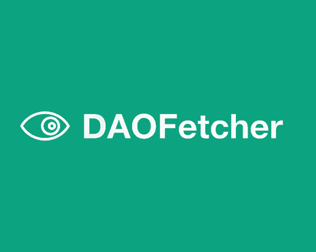
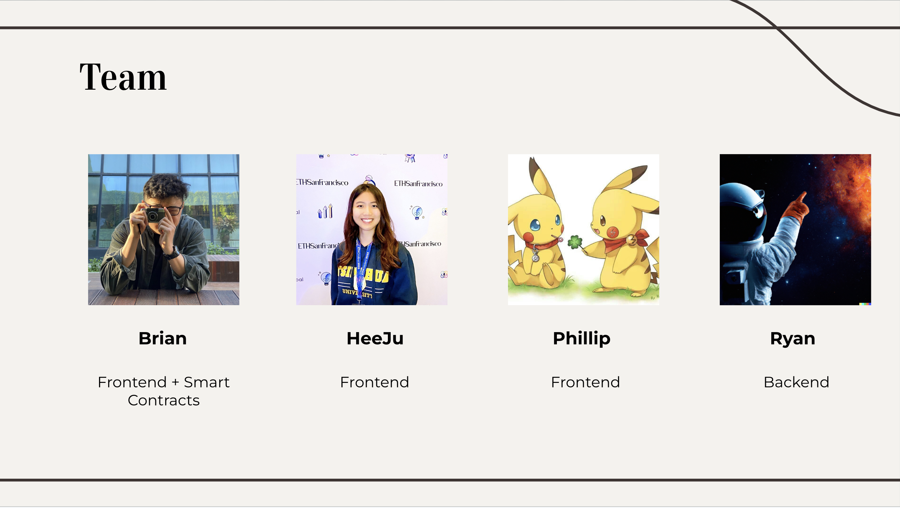

# DAOFetcher

DAOFetcher is a platform for users to easily receive updates and learn about a given DAO's culture through discord summarization with the aid of OpenAI's gpt-3.5-turbo built on Polybase and EVM chains.

*Built for the [Scaling Ethereum](https://ethglobal.com/events/scaling2023) hackathon*

## Description

DAOFetcher is an intelligent platform tool that allows users to quickly read summaries and access select token-gated content in order to orient and get a sense of a given DAO's culture. By combining our self-written and deployed EVM smart contracts (Polygon, Mantle, and more), aggregation features, and OpenAI's gpt-3.5-turbo, polybase for easy data storage of user's chat history with chatGPT, we offer users unique insights into the world of DAOs and what they offer in seconds.

## Motivation

A few of our team members have extensive experience running large DAOs. One thing they noticed was that understanding a given DAO and keeping up with all their updates becomes extremely unwieldly as people join more Discord servers. We wanted to solve the fundamental question:

How can we improve DAO accessibility?

1. People are disoriented when they first join a DAO Discord server and are really overwhelmed with the large amounts of information thrown at them.
2. Not everybody wants to (or have the means to) buy the standard NFT membership to join and get to be a part of a given DAO's community. We wanted to offer a cheaper or lighter access solution for the community to get to know the DAO first before they make their purchase decision.
3. Not everyone has the same on-chain access to DAO communities (some might only have a chain gas token that is not native to the original DAO community’s membership NFT).

## How It Works?
DAOs register with DAOFetcher and set NFT membership parameters

Users connect their wallet, browse, and purchase NFTs with registered DAOs

Read channel summaries and other analytics to learn about key information and DAO culture

## Example

BAYC is an exclusive community that can only joined after purchasing their NFT, by using our service to provide a “light” membership of BAYC, which has access to certain channels’ summaries, users can get a taste of the DAO before they actually make their big purchase, or just get the latest updates from the server.

Bankless is a open community that is known for its rich activities, but in order for users to keep up with the DAO’s progress, it requires significant amount of time to from users who are usually only parttime participating in the DAO. We hope to provide a lighter access for users to stay updated with the DAO with our light membership and only check the actual servers when they think some stuff explained in the summary interests them.

## Smart contracts

All contracts are deployed to the following chains:

- [Polygon Mumbai](https://mumbai.polygonscan.com/address/0xC51488FC5fD890a110282cB8a6Faf947A5caCD6E#code): 0xC51488FC5fD890a110282cB8a6Faf947A5caCD6E
- [Optimism Goerli](https://goerli-optimism.etherscan.io/address/0xAa11bE646F0725B61c2d5595245Db94b3F6698C6#code): 0xAa11bE646F0725B61c2d5595245Db94b3F6698C6
- [Scroll Testnet](https://blockscout.scroll.io/address/0xAa11bE646F0725B61c2d5595245Db94b3F6698C6/transactions#address-tabs): 0xAa11bE646F0725B61c2d5595245Db94b3F6698C6
- [Mantle Testnet](https://explorer.testnet.mantle.xyz/address/0xAa11bE646F0725B61c2d5595245Db94b3F6698C6): 0xAa11bE646F0725B61c2d5595245Db94b3F6698C6
- [Gnosis Chain(Chiado)](https://blockscout.chiadochain.net/address/0xAa11bE646F0725B61c2d5595245Db94b3F6698C6): 0xAa11bE646F0725B61c2d5595245Db94b3F6698C6

## Frameworks and Tools

This project uses a variety of technologies across both the frontend and backend.

### Frontend:
- Next.js: for frontend framework and implementations
- WalletConnect (+ Rainbow): for a beautiful and seemless wallet experience for users

### Backend:
- Polybase: for storing Chat data and load chat data for users!
- OpenAI gpt-3.5-turbo: Summarizing Discord Chat Histories
- Discord bot written in Python: Acts as the backend proxy that connect discord and the frontend page.

### Smart contracts:
- Hardhat/Solidity: self writtened solidy codes that manages users membership as well as discord Server DAO onchain.
- Deployed to: Polygon, Optimism, Scroll, Mantle, and Gnosis Chain (Chiado)

## Team members

